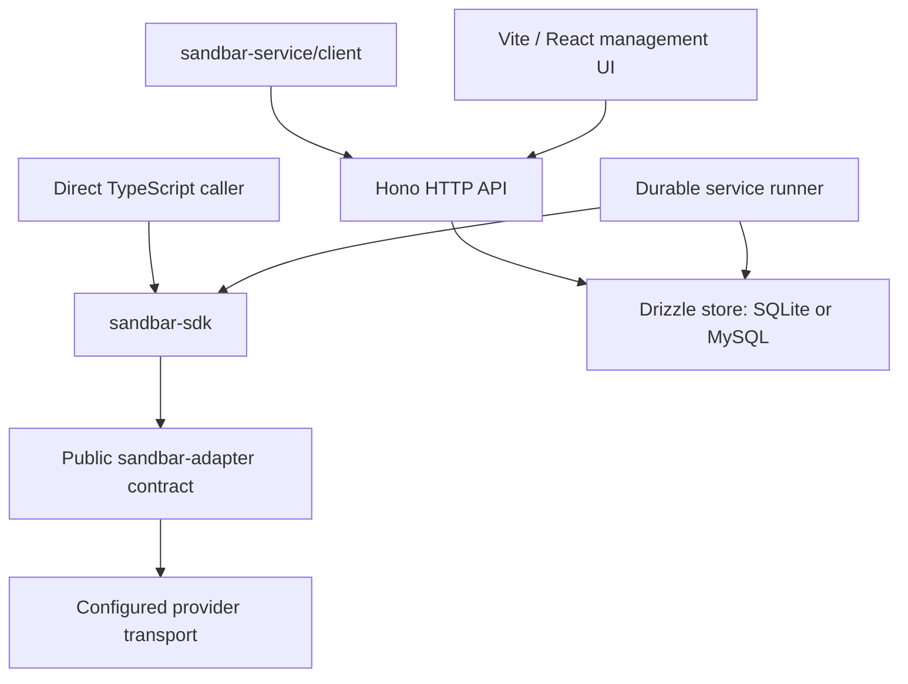

# Sandbar architecture

Current implementation · September 28, 2026

Sandbar is a server-side TypeScript SDK with an optional self-hosted service. Direct callers connect an installed adapter in Node.js or Bun. Service clients use HTTP to reach the Bun/Hono service, which adds credential custody, projects, durable operations and the management UI.

## Execution paths

The SDK has no service, SQL or hidden-daemon dependency. The service runner uses the SDK's public advanced prepare/submit/observe lifecycle. Direct and service execution share adapter validation, scope checks, binary results and mutation uncertainty semantics.

## Package boundaries

| Location | Responsibility |
| --- | --- |
| `packages/sdk` | Consumer resource handles, direct execution engine, recovery references and built-in subpaths |
| `packages/adapter` | Public adapter definitions, portable schemas, mutation runtime and conformance helpers |
| `packages/providers/*` | Provider-specific validation, transport and fixtures |
| `packages/core`, `packages/provider-spi` | Private shared semantics and remaining internal driver types/helpers; not the public adapter authoring surface |
| `packages/service` | Service factory and separate HTTP client subpath |
| `packages/service-runtime` | Durable runner, provider registry and credential encryption |
| `packages/store` | Dialect schemas, migrations, admission, leases, output reservations and persisted observations |
| `apps/server` | Hono routes, authentication, HTTP schemas, OpenAPI and runtime composition |
| `apps/web` | Vite, React, TanStack Router and Tailwind management UI |
| `apps/docs` | Astro/Starlight public documentation and executable examples |

Daytona and E2B are built-ins; Modal is external and experimental. The fake provider is a deterministic fixture. Provider availability and guarantees are documented in each provider's README and [qualification evidence](../packages/sdk-qualification/provider-qualification/README.md). New providers use the same public adapter API.

## State and recovery

Direct operation state lasts for the client process. Serializable references allow observation after reconnecting with the same verified scope when native evidence exists; they do not replay mutations or schedule work after process exit.

The service persists admission and a submission marker before provider effects. A leased runner records outcomes and recovery-token updates. After interruption, possibly submitted work is observed rather than dispatched again. Database leases fence local commits; an expired lease does not prove the provider call stopped. Local abort and client close stop waiting without confirming remote cancellation or destroying compute.

SQLite is the default service store; MySQL has a separate backend and migration history. Current schemas cover operators/sessions, projects, provider connections, sandboxes, operations/attempts, executions, invocation keys, output reservations, resource events and basic usage evidence. The authoritative layouts are the [SQLite](../packages/store/src/schema/sqlite.ts) and [MySQL](../packages/store/src/schema/mysql.ts) sources. Basic usage evidence does not constitute a cost-accounting subsystem.

The service encrypts provider credentials and retained sensitive data using a separately configured key file. The UI uses the service API and does not receive provider credentials. SQLite enforces local ownership of its database; neither the MySQL backend nor the runner implies a qualified multi-node deployment. See the [operating guide](../apps/docs/internal/self-hosting/operations.md) for deployment constraints.

## Contract sources

Use [package conventions](package-conventions.md) for public names and dependency rules, [validation](validation-and-contracts.md) for IO boundaries, and [qualification](../packages/sdk-qualification/README.md) for test coverage. Manifests and the lockfile own dependency versions.

Snapshots, mounts and suspension are the next changes described in [state portability](provider-state-portability.md). [Interactive execution and access](interactive-execution-and-access.md) remains a later draft. Neither appears as an implemented component in this architecture.
