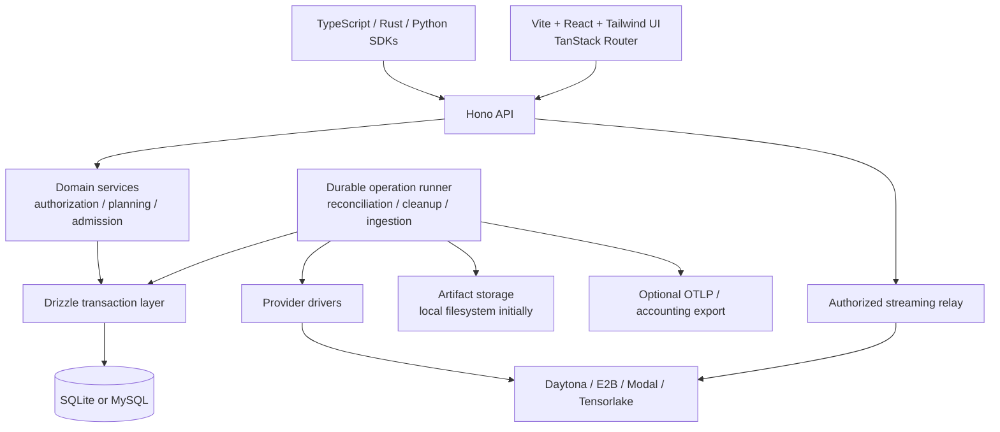

# Sandbar architecture

Selected architecture · Updated September 27, 2026 · Core service and TypeScript SDK implemented; broader resource features remain proposals

## Decision

V1 is a self-hosted TypeScript service using **Hono, relational storage through Drizzle, and a Vite UI styled with Tailwind**. The implementation direction is Bun, SQLite by default, MySQL as a tested deployment option, React with TanStack Router, and Zod 4 for IO contracts. This supersedes the [Worker/DO baseline](archive/sandbar-design-v0.3.md). Cloudflare, celld, Durable Objects and D1 are not v1 deployment dependencies.

The user selected Hono, MySQL or SQLite, latest-beta Drizzle, Vite, Tailwind and Zod or Valibot. The choices within those alternatives are SQLite for the simplest install, MySQL for operators with database infrastructure, Zod 4, and TanStack Router for nested resource/settings routes and validated URL filters. Bun follows the proposed installable service model. The service, packages and migrations are implemented. This document also retains design targets for features outside the initial slice; see the [current implementation plan](../plans/implementation-plan.md) and package documentation for supported behavior.

The npm registry's `beta` tag returned **1.0.0-beta.22** for both `drizzle-orm` and `drizzle-kit` during this decision. Both packages are pinned exactly in the committed manifests and lockfile; do not use a floating beta range. The separate `rc` tag returned `1.0.0-rc.4`; do not silently substitute that channel. Current docs can describe later prereleases, so verify APIs against the pinned packages. Other dependency versions are recorded in the manifests and lockfile.

Sandbar provides a consistent API over Daytona, E2B, Modal, Tensorlake and future providers without hiding differences in security, storage or lifecycle. TypeScript direct and remote SDKs are implemented; Rust and Python remain remote SDK design targets. Streaming beyond the captured-output interface remains proposed. Handwritten SDK ergonomics wrap generated transport/models.

The refined [contracts](contract-recommendations.md), [storage/images](storage-and-images.md), [observability/accounting](observability-and-accounting.md), [validation](validation-and-contracts.md), and [management UI](management-ui.md) define the behavioral requirements.

## Optional direct TypeScript mode

The accepted [direct SDK plan](direct-typescript-sdk.md) adds direct provider access without a service, database or hidden daemon. The portable `packages/core` now contains shared request normalization, result correlation and bounded output helpers; `packages/service-runtime` owns the store-dependent durable runner and key custody. The direct SDK in `packages/sdk` uses the portable contracts and provider SPI. Keep the following service topology intact behind the HTTP backend. Administration, durable scheduling, shared fleet/quotas and accounting remain service concerns.

## Topology

This is the target architecture. Rust/Python clients, streaming relay, artifact storage and accounting/OTLP export shown below remain proposals beyond the implemented service and TypeScript slice.

Initially one service process serves the API and prebuilt UI, runs the durable scheduler, and relays bounded streams. Module separation permits later isolation of expensive work without requiring distributed deployment now. Production UI and API share an origin. No Redis or external queue is required for initial coordination.

The database stores control metadata, durable evidence and bounded retained output. Provider volumes, checkpoints and images retain their bytes at the provider. Uploaded contexts and large artifacts use a local blob directory initially, with metadata and retention references in SQL; an object-store backend can follow.

## Relational resource model

| Tables | Purpose |
|---|---|
| `projects`, `memberships`, `api_tokens`, `sessions` | Ownership, authorization and human/API identity |
| `provider_connections`, `credential_versions` | Stable native scope, verified connection state, encrypted credentials |
| `resources` | Thin project-scoped identity/type registry for dependencies and evidence; typed tables hold actual resource state |
| `sandboxes`, `resource_labels` | Desired/observed lifecycle state, native mapping, freshness, resource revision and searchable labels |
| `operations`, `operation_attempts`, `executions`, `quota_reservations` | Accepted intent, invocation dedupe, provider submission evidence, command outcomes and reserved capacity |
| `environment_revisions`, `environment_channels`, `network_policy_revisions`, `secret_versions` | Immutable definitions, mutable references, encrypted secrets and policy lineage |
| `images`, `image_preparations`, `build_contexts` | Prepared image identities, build/import progress, provenance and upload metadata |
| `volumes`, `mounts`, `volume_versions`, `checkpoints` | Independent persistent resources, attachment sessions, retained versions and capture contracts |
| `native_artifacts`, `artifact_references`, `resource_dependencies` | Managed/borrowed ownership, shared native artifacts, retention pins and deletion restrictions |
| `endpoints`, `access_grants`, `stream_sessions` | Scoped access, expiry and connection/session metadata |
| `resource_events`, `provider_event_inbox`, `outbox_events` | Durable timeline, deduplicated ingress and external delivery work |
| `usage_records`, `cost_records`, `rate_cards`, `accounting_assignments`, `billing_account_links`, `audit_events` | Usage evidence, distinct cost bases, operator billing scope and effective-dated attribution |

These are logical table names, not final DDL. Use explicit typed columns for commonly queried state; versioned JSON for bounded extensible manifests, never as an unvalidated catch-all. Enforce same-project relationships with composite constraints or equivalent transactional checks. Provider-specific native identities include connection/account scope. Do not physically cascade deletes through independently retained resources or accounting evidence.

Fleet pages query `sandboxes` joined to connections, labels and current operation summaries, with project-scoped indexes and cursor pagination. There is no ProjectDO fleet projection to synchronize. A committed observation is visible to subsequent database reads, but provider reality can still be newer: retain `observed_at`, observation errors and source ordering evidence. A Sandbar revision does not prove native event freshness.

Volumes and checkpoints outlive compute when their contracts require it. SQL stores native locators, capabilities, retention, lineage and dependencies; it does not turn native snapshots into portable image bytes. One native artifact can back several logical roles, so cleanup checks every pin/reference. Requested deletion, confirmed provider deletion and billing cessation remain distinct.

## Durable operation lifecycle

1. Validate and authorize the request. In a short transaction, look up the project-scoped invocation key before applying current defaults. Check intent hash, reserve IDs/capacity, freeze local references, persist accepted intent and due work, and append relevant evidence. Commit before returning HTTP 202.
2. A runner claims due work using a lease and generation. Persist an attempt/submission marker and stable provider idempotency/discovery information before external effects. Do not keep a SQL transaction open during provider IO.
3. Call the selected driver. Commit validated observations, state/revisions, reservation changes, usage evidence and external outbox records together. Additional phases become durable due work.
4. After interruption, scan due work and reconcile attempts that may have been submitted. A lease expiring does not prove a provider call stopped. Database fencing prevents stale commits, not external effects; ambiguous create/exec must not be dispatched again merely because a claim can be reacquired.

`operations.next_attempt_at` and persisted phase/attempt state are the initial work source of truth. Timers only wake the scanner. Bounded concurrency, backoff and provider rate limits protect the API and database. Unknown outcomes retain evidence and artifact pins until reconciled; operator acknowledgement does not declare them safe to replay.

Keep narrow domain transaction methods such as `admitMutation`, `beginSubmission`, and `recordObservation`. Avoid a generic CRUD abstraction that hides the invariants different dialects must uphold. SQL outboxes remain useful for external events/exports, not for copying fleet state between controllers.

## SQLite and MySQL

Both dialects are v1 implementation targets; SQLite is the default installation. Support is advertised only after each passes the same transaction/recovery suite. Keep explicit dialect schemas and migration histories behind the domain store; Drizzle does not make locking, decimal/JSON representation, collation, timestamps, upserts or returning behavior identical.

SQLite uses local persistent storage, foreign keys, WAL and a qualified durability configuration. Start with one active service and an enforced process-lifetime lock. The lock resolves symlink aliases to one local file; hard-linked database files and network-mounted databases are outside the supported topology. Keep synchronous queries short and indexed; large reports must not stall streams and recovery. [SQLite WAL](https://www.sqlite.org/wal.html), [Bun SQLite](https://bun.sh/docs/runtime/sqlite)

MySQL uses InnoDB and tested transactions through Drizzle's MySQL adapter. Use row locks for admission/reservations where required. `FOR UPDATE SKIP LOCKED` is appropriate for work claims, not for ordinary authoritative fleet/permission reads. Test deadlock recovery, binary/case-sensitive identity semantics and UTC/decimal mappings. MySQL is an operator storage option; it does not automatically enable multiple active service nodes. This first wave accepts `mysql://`; that scheme alone makes no TLS guarantee. `mysqls://` is rejected because the pinned driver does not enable TLS from the scheme, and secure MySQL transport has not been qualified for this wave. [Drizzle MySQL](https://orm.drizzle.team/docs/get-started/mysql-new), [MySQL locking reads](https://dev.mysql.com/doc/refman/8.4/en/innodb-locking-reads.html)

## Contracts and provider isolation

The service owns HTTP Zod schemas and OpenAPI metadata in `apps/server`; the SDK owns portable resource validation. `packages/core` owns policy, placement, operations and resource semantics. `packages/store` owns Drizzle schemas, migrations and transaction implementations. Provider modules own native schemas and driver translation. `apps/server` composes Hono, the runner and IO; `apps/web` owns Vite/React/Router/Tailwind. SDK workspaces hold generated transport and handwritten language APIs. These are proposed package boundaries, not a requirement to publish every module.

Validate every IO boundary as detailed in [validation and contracts](validation-and-contracts.md). DB rows are not public API DTOs. Hono routing does not bind Rust/Python clients to TypeScript RPC inference. Runtime capability checks remain separate from syntactic validation.

Keep a small mandatory provider core plus optional drivers. Drivers never choose fallback providers or write domain state directly. Prefer standard network APIs; vendor SDKs may be used when qualified on Bun. Reconciliation, exact security requirements and mutation uncertainty remain service responsibilities.

The first-wave fake driver gives each HTTP request a 10-second transport deadline spanning response headers and body consumption. This bounds runner stalls; it does not cancel native work or shorten an execution's requested process deadline. A timed-out mutation remains a possible submission and is reconciled by observation without replay.

## Streaming, secrets and operations

Authorize process/file/tunnel sessions through ordinary domain services, then relay bytes with bounded buffers or grant scoped direct access where supported. Store session identity, receipts and bounded output, not every live traffic chunk in the operation journal. Disconnects do not imply cancellation, cleanup or rerun. Local listeners and filesystem traversal run on the SDK caller; remote builders execute Dockerfiles outside the API process.

Load the encryption key through a separately permissioned mounted key file or qualified host secret source. Keep key versions outside database and artifact backups and test rotation/recovery. A database-only copy without the key is a different threat from full-host compromise; do not claim protection when both key and ciphertext are copied. Provider credentials remain write-only through UI/API.

Ship prebuilt service code and UI assets in the installable package/container. Proposed commands are `sandbar init`, `serve`, `doctor`, and `backup`. Use committed migrations under an exclusive migration lock, not production schema push. Backups must capture a consistent database plus artifact manifest and separate key recovery; copying only an active SQLite database file is insufficient. [SQLite backup](https://www.sqlite.org/backup.html)

Native provider lifetime limits protect against service downtime where supported. A local scheduler cannot guarantee cleanup while its host is offline. Best-effort telemetry/export failures must not block cleanup or erase durable usage evidence. Multi-node availability, split streaming relays and a future Worker port require separate qualification.

## Stack references

- [Hono validation](https://hono.dev/docs/guides/validation) and [Bun setup](https://hono.dev/docs/getting-started/bun)
- [Drizzle ORM dist-tags](https://registry.npmjs.org/-/package/drizzle-orm/dist-tags) and [Drizzle Kit dist-tags](https://registry.npmjs.org/-/package/drizzle-kit/dist-tags)
- [Drizzle Bun SQLite](https://orm.drizzle.team/docs/get-started/bun-sqlite-new) and [v1 changes](https://orm.drizzle.team/docs/v0-v1-changes)
- [TanStack Router](https://tanstack.com/router/latest/docs/overview), [Tailwind with Vite](https://tailwindcss.com/docs/installation/using-vite), [Zod JSON Schema](https://zod.dev/json-schema)
