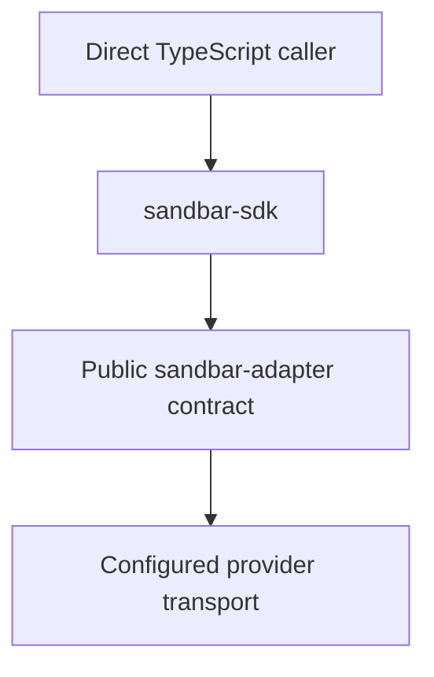

# Sandbar architecture

Current implementation · September 30, 2026

Sandbar is a server-side TypeScript SDK. Callers connect an installed adapter in Node.js or Bun. Provider credentials and application-owned persistence remain in the caller’s process.

## Execution paths

The SDK shares adapter validation, scope checks, binary results and mutation uncertainty semantics across providers.

## Package boundaries

| Location | Responsibility |
| --- | --- |
| `packages/sdk` | Consumer resource handles, direct execution engine, recovery references and built-in subpaths |
| `packages/adapter` | Public adapter definitions, portable schemas, mutation runtime and conformance helpers |
| `packages/providers/*` | Provider-specific validation, transport and fixtures |
| `packages/provider-spi` | Private internal driver types/helpers; not the public adapter authoring surface |
| `apps/docs` | Astro/Starlight public documentation and executable examples |

Daytona and E2B are built-ins; Modal is external and experimental. The fake provider is a deterministic fixture. Provider availability and guarantees are documented in each provider's README and [qualification evidence](../packages/sdk-qualification/provider-qualification/README.md). New providers use the same public adapter API.

## State and recovery

Direct operation state lasts for the client process. Serializable references allow observation after reconnecting with the same verified scope when native evidence exists; they do not replay mutations or schedule work after process exit.

Local abort and client close stop waiting without confirming provider cancellation or destroying compute. Applications can use the public advanced prepare/submit/observe lifecycle with their own persistence callbacks; recovery observes without replaying mutations.

## Contract sources

Use [package conventions](package-conventions.md) for public names and dependency rules, [validation](validation-and-contracts.md) for IO boundaries, and [qualification](../packages/sdk-qualification/README.md) for test coverage. Manifests and the lockfile own dependency versions.

[State portability](provider-state-portability.md) describes the snapshot and volume contracts. [Sandbox lifecycle](sandbox-lifecycle.md), [finite streaming](interactive-execution-and-access.md), [finite stdin](process-stdin.md), [preview/process control](preview-and-process-control.md) and [storage composition](storage-composition.md) describe implemented slices and explicitly deferred extensions.
